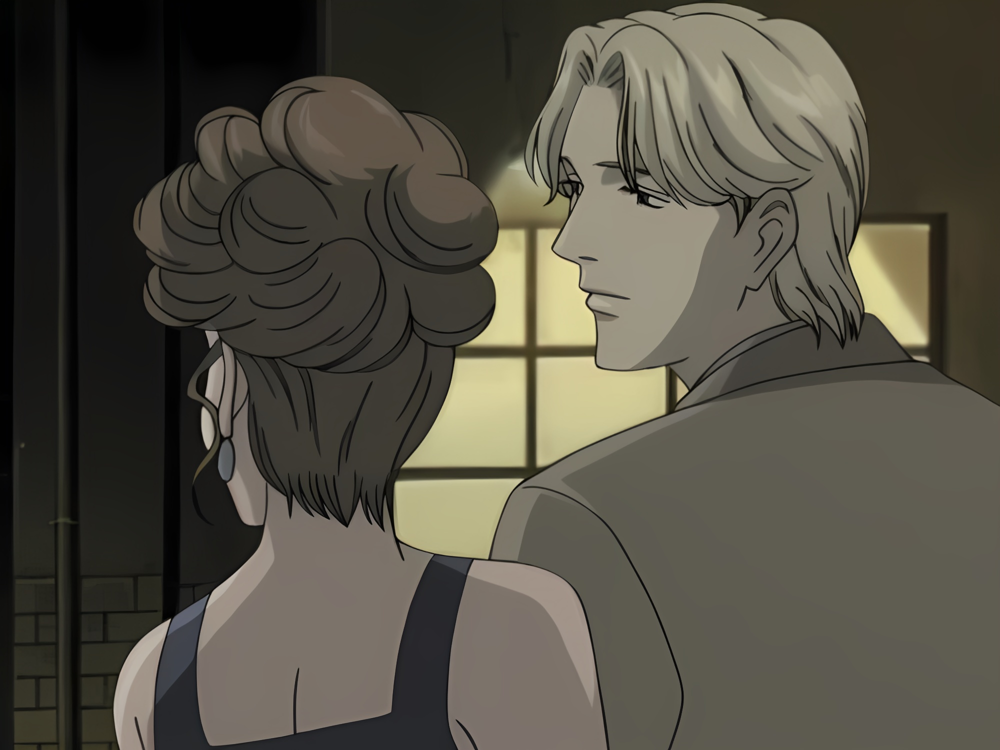

# anime upscaler

My usage of [Real-ESRGAN](https://github.com/xinntao/Real-ESRGAN) to upscale anime, I hope to use this on a proper GPU cuz doing this on CPU is completely shit 😂, I even tried on my 750Ti on my server, but the 2GB of vram was not enough 😭. 

# Some results:

## Picture

Before            |  After
:-------------------------:|:-------------------------:
  |  

## Video

### Before

https://user-images.githubusercontent.com/56494763/148880280-fb6488c1-e87c-47e4-81ec-aecc3654c9d6.mp4

### After

https://user-images.githubusercontent.com/56494763/148880247-a99d3bd5-eb7e-4371-8de2-68d55cab801e.mp4

# How To Use

For a single image:

`python3 frame_esrgan.py -m /path/to/RealESRGAN_x4plus_anime_6B.pth -i path/to/img -o path/to/img.png`

If memory usage is too high and you need to split frames and stitch back together use the `-s, --split` argument. Default number of splits is 4, but you can make as many as you want.

Please note that the output of a single image must be a PNG due to alpha channel. Will be fixed in the future hopefully

For a video:

`python3 anime_upscaler.py -m /path/to/RealESRGAN_x4plus_anime_6B.pth -i path/to/video -o path/to/desired/output -s -a`

If you do not want audio, remove the `-a` at the end
